<!-- ===================================================== -->
<!--  DARK • NEON • ANIMATED • AUTO-UPDATING GITHUB README -->
<!-- ===================================================== -->

  

<h2 align="center" style="color:#7ef9ff;">AI Engineer • Full-Stack Developer • Automation Enthusiast</h2>

---

## 🖤 About Me
I’m **Krishna Naik**, a passionate programmer focused on:

- 🚀 AI & Automation  
- 🎨 Web Design (UI/UX + Modern Frontend)  
- 💻 MERN Stack Full-Stack Development  
- 🤖 Machine Learning & Data Science  
- 📱 Building Web, Mobile & Desktop Apps  

I love solving real-world problems using **React, MERN, and Python**, while creating visually appealing and optimized user experiences.

---

## 🛠 Tech Stack

### **Frontend**

  

### **Backend**

  

### **Databases**

  
  

### **AI / ML**

  
  
  

### **Tools**

  
  

### **Cloud**

  

---

# 📊 My Growth — Animated SVG + Auto-updating PNGs

### **📈 Projects Completed Over Years (Animated SVG)**

  

---

### **📊 Technologies Learned Over Years (Animated SVG)**

  

> 🔁 PNG versions are automatically updated daily using **GitHub Actions**.

---

# 🔥 Featured Projects

### 1️⃣ **Voice-Based PPT Controller**
Control PowerPoint using speech commands.  
**Tech:** Python · SpeechRecognition · PyAudio · OpenCV  
🔗 Repository: *coming soon*

---

### 2️⃣ **Daily Activity Manager + Portfolio Website**
A custom dashboard + portfolio + Google Drive API integration.  
**Tech:** MERN · Tailwind · Vercel  
🔗 Repository: *coming soon*

---

### 3️⃣ **Handwritten Digit Recognition (CNN)**
Recognizes digits using deep learning.  
**Tech:** Python · TensorFlow · OpenCV  
🔗 Repository: *coming soon*

---

# 📈 GitHub Stats (Dark Mode)

  
  

  

---

# ⚙️ Auto-Updating Charts (GitHub Actions)

Your charts update automatically every day using:

This regenerates the PNG chart images and commits them back into your repository so your README always stays updated.

---

# 📬 Contact Me

  
  
  

---

🚀 Dark Neon GitHub Profile • © 2025 Krishna Naik  

