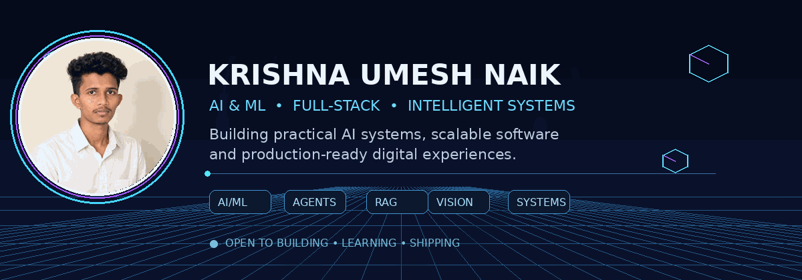

 

 

**Bengaluru, Karnataka** · **+91 93536 40765** · **kn670423@gmail.com**

---

## 👋 About Me

I’m **Krishna Umesh Naik**, a Computer Science (AI & ML) student and full-stack developer with internship experience building web and mobile applications. My work spans **React, React Native, Node.js, NestJS, PostgreSQL, REST APIs, real-time systems, distributed computing, and AI-powered applications**.

I enjoy turning practical problems into production-oriented software and exploring **Generative AI, Agentic AI, Computer Vision, NLP, distributed systems, Big Data, cloud computing, and scalable system design**.

> **Current focus:** building practical AI systems that combine intelligent agents, local models, retrieval, automation, and reliable software engineering.

---

## 🎓 Education

| Period | Education |
|---|---|
| **2025 – Present** | **Ramaiah Institute of Technology, Bengaluru, Karnataka** — Bachelor of Engineering in Computer Science (AI & ML) |
| **2024** | **Govt. Polytechnic, Siddapur (Uttara Kannada)** — Diploma in Computer Science |
| **2022** | **Govt Mohan K Shetty P U College, Honnvar (Uttara Kannada)** — Pre-University Course (PUC), Science |

---

## 💼 Professional Experience

### Software Engineer Intern · Intelligent Development and Programming Pvt. Ltd.
**Jul 2026 – Present**

- Developing cross-platform applications using **React Native**, including flight tracking, real-time updates, push notifications, and airport assistance features.
- Working with **NestJS, Redis/BullMQ, and Docker** on backend workflows.
- Developing and integrating **REST APIs** and external API integrations across frontend and backend workflows.

### Full-stack Development Intern · CanaraTechLabs Pvt Ltd
**Jan 2024 – Apr 2024**

- Developed and maintained full-stack web and mobile applications using **React, React Native, Node.js, NestJS, and PostgreSQL**.
- Implemented **30+ reusable components and REST APIs** for production workflows.
- Built a multilingual news application with improved accessibility and translation support.
- Contributed to the **Sprentzo Sports platform** with interactive user-engagement features.

---

## 🚀 Selected Projects

### 🧠 AURA — Personal AI Operating System
**Python · Local AI · Agents · Vision · Voice · RAG · PostgreSQL/SQLite**

A local-first personal AI operating system designed to manage tasks, communications, system events, codebases, sensors, vision streams, voice interaction, and workflows. The project uses agent/tool separation, policy-based security, asynchronous events, persistent DAG workflows, multi-tier memory, model routing, and auditability.

**Live repository:** [`KrishnaNaik6/AURA`](https://github.com/KrishnaNaik6/AURA)

---

### 🛒 SmartKirana AI
**React · Node.js · Express.js · PostgreSQL · FastAPI · OCR · LLM · REST APIs**

AI-powered retail management software for digitizing kirana-store operations through **OCR-based billing, voice input, WhatsApp NLP order processing, smart inventory tracking, and demand prediction**.

**Live repository:** [`KrishnaNaik6/SmartKirana`](https://github.com/KrishnaNaik6/SmartKirana)

---

### 📚 DocAgent
**Python · RAG · FAISS · SentenceTransformers · Phi-3 · Ollama**

Offline agentic AI for semantic document retrieval and context-driven answer generation using **RAG, FAISS vector search, SentenceTransformers embeddings, and a local SLM**.

**Live repository:** [`KrishnaNaik6/DocAgent`](https://github.com/KrishnaNaik6/DocAgent)

---

### ✏️ Explainable AI Diagram Generator
**Python · PyTorch · Diffusion Models · LoRA · FastAPI · Gradio · OpenCV**

A diffusion-based generative framework for **interpretable hand-drawn educational and technical diagrams**. The system combines attention-map analysis with LoRA fine-tuning and generates both visual outputs and natural-language explanations of the generation process.

**Live repository:** [`KrishnaNaik6/Explainable-AI-Diagram-Generator`](https://github.com/KrishnaNaik6/Explainable-AI-Diagram-Generator)

---

### 🏟️ Sprentzo
**React · Node.js · Express.js · PostgreSQL**

Full-stack sports-equipment rental work with an admin platform for managing equipment, rentals, and user operations. The public GitHub account includes the Sprentzo admin-panel repository.

**Live repository:** [`KrishnaNaik6/sprentzo_admin-panel`](https://github.com/KrishnaNaik6/sprentzo_admin-panel)

---

### ⚡ Hadoop–Spark Cluster
**Hadoop · Apache Spark · Linux · HDFS**

Implemented a multi-node Hadoop and Spark cluster for distributed data processing and large-scale dataset analysis.

---

### Other Work

- **Voice-Based PPT Controller** — speech-controlled PowerPoint interaction using Python, SpeechRecognition, PyAudio, and OpenCV.
- **Daily Activity Manager + Portfolio Website** — dashboard and portfolio work involving MERN, Tailwind, Vercel, and Google Drive API integration.
- **Handwritten Digit Recognition (CNN)** — digit recognition using Python, TensorFlow, and OpenCV.

---

## 🧰 Technical Skills

### 🧊 3D Skills Matrix

 

### 💠 Languages

### ⚛️ Frameworks & Runtime

### 🗄️ Databases · Cloud · DevOps

 

### 🧠 AI / ML · Vision · Data

### 🛠️ Engineering Toolkit

> **Design note:** GitHub profile READMEs can render images and GIFs, but repository-rendered SVGs do not support inline scripting or animation. The skills section therefore uses layered icon tiles plus clickable “3D” badge cards to create depth without relying on unsupported page-level JavaScript/CSS. citeturn544072search0turn544072search3

---

## 📊 GitHub — Live Activity & Real-Time Metrics

### 🐍 Animated Contribution Graph

<picture>
  <source media="(prefers-color-scheme: dark)" srcset="https://raw.githubusercontent.com/KrishnaNaik6/KrishnaNaik6/main/dist/github-snake-dark.svg" />
  <source media="(prefers-color-scheme: light)" srcset="https://raw.githubusercontent.com/KrishnaNaik6/KrishnaNaik6/main/dist/github-snake.svg" />
  
</picture>

The animation is generated automatically from **KrishnaNaik6's real GitHub contribution activity** by GitHub Actions and refreshed daily.

### 🟩 Live GitHub Contribution Activity

### 📈 Live GitHub Signals

> **No fabricated contribution numbers are hardcoded here.** The contribution calendar and animation are generated from GitHub activity, while the badges read live repository/account signals.

---

## 📌 Featured GitHub Projects

---

## 🌱 Interests

- **AI/ML:** Generative AI, Agentic AI, Computer Vision, NLP, explainable AI
- **Systems:** Distributed Systems, Big Data, Cloud Computing, scalable system design
- **Engineering:** Full-stack development, real-time systems, APIs, automation, production-oriented software

---

## 📫 Let's Connect

<a href="mailto:kn670423@gmail.com">📧 Email</a> ·
<a href="https://www.linkedin.com/in/krishnaunaik/">💼 LinkedIn</a> ·
<a href="https://krishna-naik.vercel.app/">🌐 Portfolio</a> ·
<a href="https://github.com/KrishnaNaik6">🐙 GitHub</a>

  

---

**Building useful software. Exploring intelligent systems. Learning continuously.**

